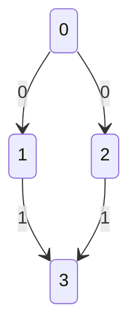

<<<<<<< HEAD
<pre>
program -> statement | statement
statement_list -> <b>λ</b> | statement statement_list
statement -> <b>END</b> | assignation <b>END</b> | assignation <b>END</b>
</pre>
=======
## Tipos de datos

Disponemos del tipo entero para operaciones numéricas:
```python
23
```

Un símbolo es representado como un string python:
```python
'a'
```

Un multiconjunto se expresa como un set de símbolos (string) python, solo que permite elementos repetidos:
```python
{'a', 'a', 'beta', 'b', 'beta'}
```

Una membrana se expresa como su identificador (un entero positivo) entre corchetes:
```python
[1]
```

Un canal se expresa como su identificador (un entero positivo) entre signos de menor y mayor:
```python
<1>
```

## Operaciones básicas
### Asignación

Enteros, símbolos y multiconjuntos se pueden almacenar en una variable mediante el operador de **asignación** (``=``):
```python
entero = 42
alfa = 'alfa'
a = {alfa, 'a1', 'a2'}
```

Dicho operador también se puede emplear para definir el contenido de una membrana:
```python
[1] = {'a1', 'a2'}
```

El contenido de una variable se puede emplear como identificador de una membrana o de un canal, 
siempre que dicho valor sea entero:
```python
i = 12
[i] = {'a1', 'a2'}
```

### Operaciones sobre enteros

Las operaciones sobre enteros son el **producto** (``*``), la **división entera** (``/``), la **suma** (``+``) 
y la **resta** (``-``):
```python
8 * 2    # 16
9 / 2    # 4  
2 + 8    # 10
8 - 2    # 6
```

### Operaciones sobre símbolos

Al tratarse de strings, se pueden realizar las operaciones de concatenación (``+``) y el producto (``*``):

```python
'a' + 1      # 'a1'
'a' + 'b'    # 'ab'  
'ab' * 3     # 'ababab'
```

Cabe destacar que para símbolos el producto solo está definido con un entero por la derecha, 
cualquier alternativa devolverá un error.

```python
'a' * 'a'    # Error
2 * 'a'      # Error
```


### Operaciones sobre multiconjuntos

Sobre multiconjuntos tenemos definida la unión (``|`` o  ``+``), la intersección (``&``), la diferencia (``-``)
y el producto (``*``);

```python
{'a', 'b'} + {'b'}              # {'a', 'b', 'b'}
{'a', 'b'} | {'b'}              # {'a', 'b', 'b'}
{'a', 'b'} & {'a', 'a'}         # {'a'}
{'a', 'a', 'b'} - {'a', 'c'}    # {'a', 'b'}
{'a', 'b'} * 2                  # {'a', 'a', 'b', 'b'}
```


### Entrada y salida

Para especificar las membranas de entrada y salida se utilizan los operadores ``in`` y ``out``.

<pre><code><span style="color:#cc7836">in</span> [<span style="color:#6797bb">0</span>]
<span style="color:#cc7836">out</span> [<span style="color:#6797bb">3</span>]
</code></pre>


### Canales

Para especificar una sinapsis perteneciente a un canal, se emplea la siguiente sintaxis:

``<canal> [membrana origen] --> [membrana destino]`` 

Por ejemplo:
```python
<0> [0] --> [1]
<0> [0] --> [2]

<1> [1] --> [3]
<1> [2] --> [3]
```

Obteniendo el siguiente grafo:




### Producciones

Una producción se especifica mediante la siguiente sintaxis:

``[membrana] regex / {multiset} --> {multiset} <canal>, {multiset} <canal>, ...`` 

Por ejemplo:

```python
[0] ('a' 'a' 'b'*)+ / {'a', 'b'} --> {'a', 'a'} <0>, {'b'} <1>
```

De modo que si en la membrana 0 se encuentra un multiset que se ajuste a la expresión regular _(aab*)+_, 
se elimina un símbolo _a_ y un símbolo _b_ de la membrana 0 y se envían 2 símbolos _a_ por el canal 0 y un 
símbolo _b_ por el canal 1.


## Ejemplo

A continuación vamos a definir un Spiking Neural P-System sencillo para mostrar como se implementaría un modelo,
tomaremos como problema a resolver una versión simplificada del famoso test Fizz Buzz, nuestro objetivo 
será contar cuantos números del 1 al 100 son múltiplos de 3 y cuantos múltiplos de 5, para ello definimos el 
siguiente modelo:

```python
in [0]
out[4]

[0] = {'a'} * 100

<0> [0] --> [1]
<1> [1] --> [2]
<2> [1] --> [3]
<0> [2] --> [4]
<0> [3] --> [4]

[0] 'a'+ / {'a'} --> {'a', 'b', 'c'} <0>

[1] 'b'('a' 'a' 'a')+ / {'b'} --> {'a'} <1>
[1] 'c'('a' 'a' 'a' 'a' 'a')+ / {'c'} --> {'a'} <2>

[2] 'a' / {'a'} --> {'fizz'} <0>
[3] 'a' / {'a'} --> {'buzz'} <0>
```

En este caso se está asumiendo máximo paralelismo e instantes de tiempo discretos (es decir, 
se aplican una vez todas las reglas disponibles en un instante de tiempo, antes de avanzar al siguiente).

También cabe destacar que se ha complicado arbitrariamente la solución para mostrar el funcionamiento de 
los canales.

Al acabar el programa, solo debemos contar el número de símbolos _fizz_ y el de _buzz_ para obtener el número
de múltiplos de 3 y de 5 respectivamente.
>>>>>>> ec7b08444f8ae1c56c60cd8236fc51def86ee232
